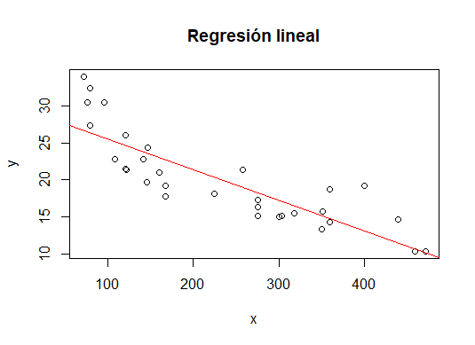
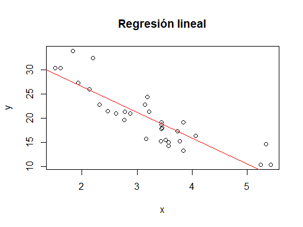
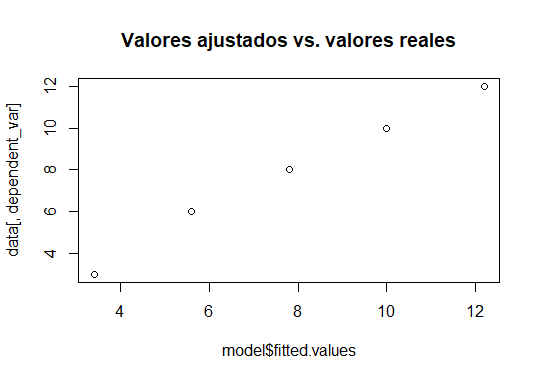
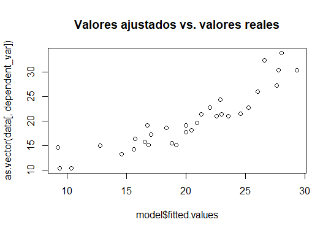
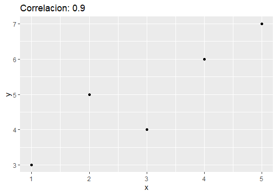
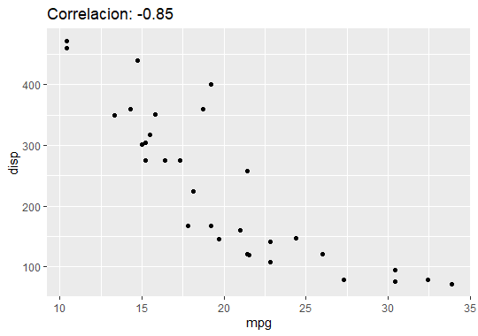

------------------------------------------------------------------------

------------------------------------------------------------------------

# FuncionesRST: a demo package

## This is a demo package from R4DS tutorial.

##### Any contact suggestion to the following email "[angel.morales\@est.ikiam.edu.ec](mailto:angel.morales@est.ikiam.edu.ec)"

## Installation and loading

#### Install the latest version from [GitHub] (<https://github.com/RicardoMorales2001/FuncionesRST>) as follow:

# Install

#### if(!require(devtools)) install.packages("devtools")

#### devtools::install_github("<https://github.com/RicardoMorales2001/FuncionesRST.git>")

## Distribution of functions in the package

## *1st function: simple linear regression*

### library(FuncionesRST)

Loading required package: dplyr; testthat; tidyverse

### Explanation and description

The reg_linear function is a function in R that performs a linear regression between two vectors x and y. The main purpose of the function is to fit a straight line to a two-dimensional (x,y) data set and to display the straight line fit along with the data on a graph.

The function starts with an if statement to make sure that the vectors x and y have the same length. If not, the function issues an error message and stops.

The function then uses the lm function of R to fit a simple linear regression model of y on x. The lm function takes a formula as an argument, in which the independent variable (x) is to the right of the tilde (\~) and the dependent variable (y) is to the left.

After fitting the model, the function uses the plot function to plot the data, with x-values on the horizontal axis and y-values on the vertical axis. The abline function is used to add the fitted regression line to the plot, using the fitted linear regression model as an argument and setting the color of the line to red.

Finally, the function returns the fitted linear regression model. This allows the user to inspect the model fit results and obtain information such as the fitted regression line coefficients, the fitted y values for any value of x, and model statistics.

## Examples

### 1st example

This example uses simple vectors as data, the next example will use data from the mtcars library available in RStudio

```{r}
x <- c(95, 85, 72.5, 60, 15, 25, 2, 3, 4, 5)
y <- c(75, 25, 12.5, 18, 20, 26, 2, 4, 5, 6) 
reg_lineal(x, y)
```

```         
Call:
lm(formula = y ~ x)
Coefficients:
(Intercept)            x  
   29.59985     -0.04122 
```

{width="523"}

### 2nd example

Example using the mtcars library

```{r}
x <- mtcars$wt
y <- mtcars$mpg
reg_lineal(x, y)
```

```         
Call:
lm(formula = y ~ x)
Coefficients:
(Intercept)            x  
     37.285       -5.344
```

{width="507"}

## *2nd function: multiple linear regression*

### Library(FuncionesRST)

Loading required package: dplyr, testthat, tidyverse

### Explanation and description

The multi_reg function is used to fit a multiple linear regression model to a data set. It takes three arguments:

-   data: a data frame containing the dependent and independent variables.

-   dependent_var -- The name of the dependent variable to use in the model.

-   independent_vars -- A list of independent variable names to use in the model.

The function performs some checks to make sure that the arguments have been supplied correctly. First, it checks that data is a dataframe. If not, the execution of the function is stopped with an error message.

Next, it checks if the dependent variable (dependent_var) exists in the dataframe. If not, the function stops and displays an error message that the variable does not exist.

It then verifies that all supplied independent_vars exist in the dataframe. If any of the variables does not exist, the execution of the function is stopped with an error message.

After the checks, the function builds a formula for the multiple linear regression model using the supplied dependent and independent variables. Use the paste function to combine the variables into a string and create the formula.

It then uses the **lm** function to fit the multiple linear regression model to the given data. The function returns a linear model object (model) that is used to perform the analysis.

Finally, the function prints a summary of the model using the summary function and plots the fitted values against the actual values using the plot function. The function returns the model object (model).

## Examples

### 1st example

```{r}
data <- data.frame(x1 = c(1, 2, 3, 4, 5), x2 = c(2, 4, 6, 8, 10), y = c(3, 6, 8, 10, 12))
multi_reg(data = data, dependent_var = "y", independent_vars = c("x1", "x2"))
```

```         
Call:
lm(formula = formula, data = data)

Residuals:
         1          2          3          4          5 
-4.000e-01  4.000e-01  2.000e-01 -3.053e-16 -2.000e-01 

Coefficients: (1 not defined because of singularities)
            Estimate Std. Error t value Pr(>|t|)    
(Intercept)   1.2000     0.3830   3.133 0.051929 .  
x1            2.2000     0.1155  19.053 0.000316 ***
x2                NA         NA      NA       NA    
---
Signif. codes:  0 ‘***’ 0.001 ‘**’ 0.01 ‘*’ 0.05 ‘.’ 0.1 ‘ ’ 1

Residual standard error: 0.3651 on 3 degrees of freedom
Multiple R-squared:  0.9918,    Adjusted R-squared:  0.9891 
F-statistic:   363 on 1 and 3 DF,  p-value: 0.0003157


Call:
lm(formula = formula, data = data)

Coefficients:
(Intercept)           x1           x2  
        1.2          2.2           NA  
```



## 2nd example

In this example, data from RStudio was used

```{r}
multi_reg(data = mtcars, dependent_var = "mpg", independent_vars = c("hp", "wt"))
```

```         
Call:
lm(formula = formula, data = data)

Residuals:
   Min     1Q Median     3Q    Max 
-3.941 -1.600 -0.182  1.050  5.854 

Coefficients:
            Estimate Std. Error t value Pr(>|t|)    
(Intercept) 37.22727    1.59879  23.285  < 2e-16 ***
hp          -0.03177    0.00903  -3.519  0.00145 ** 
wt          -3.87783    0.63273  -6.129 1.12e-06 ***
---
Signif. codes:  0 ‘***’ 0.001 ‘**’ 0.01 ‘*’ 0.05 ‘.’ 0.1 ‘ ’ 1

Residual standard error: 2.593 on 29 degrees of freedom
Multiple R-squared:  0.8268,    Adjusted R-squared:  0.8148 
F-statistic: 69.21 on 2 and 29 DF,  p-value: 9.109e-12


Call:
lm(formula = formula, data = data)

Coefficients:
(Intercept)           hp           wt  
   37.22727     -0.03177     -3.87783  
```



## 3rd function: correlation function

### Library(FuncionesRST)

Loading required package: dplyr, testthat, tidyverse

### Explanation and description 

The my_corr_plot function is a function in R that generates a scatterplot and calculates the correlation between two numeric variables in a dataframe. The function takes three arguments: the dataframe data, and the names of the two numeric variables x_var and y_var.

The function starts with three checks. The first checks that the data argument is a dataframe; if it is not, execution is halted and an error message is displayed indicating that data must be a dataframe. The next two checks verify that x_var and y_var are column names in data; if any of them does not exist, the execution is stopped and an error message is displayed indicating the name of the column that does not exist.

After the checks, the function calculates the correlation between the two numeric variables using the cor function. Next, create a scatterplot using ggplot with the two numeric variables specified in x_var and y_var. The chart title includes the correlation rounded to two decimal places. Finally, the function prints the graph and returns the value of the calculated correlation.

## Examples

### 1st example

For this example we create simple vectors

```{r}
x <- c(1, 2, 3, 4, 5)
y <- c(3, 5, 4, 6, 7)
df <- data.frame(x = x, y = y)
my_corr_plot(df, "x", "y")
```

```         
[1] 0.9
```



### 2nd example

In this example we use the data from RStudio

```{r}
my_corr_plot(mtcars, "mpg", "disp")
```

```         
[1] -0.8475514
```



## Lifecycle

FunctionsRST is the first version of a set of functions which were created with the purpose of being able to automate repetitive processes when processing data. It is expected over time to implement things in this package, be it new functions or arguments. The change in the already existing functions could be given for a better operation or improving its functionality.

Thank you very much for using this package.
